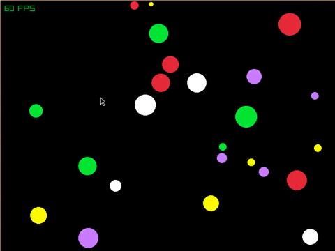

      particle collision simulator

## what's this?

- RayLib
- Elastic collision | momentum & K.E conservation

The collision checking currently has O(n^2) time-complexity, this can be made better using\
algorithms like: Sweep and Prune, Uniform Grid Space Partitioning.

The algorithm currently used is neighbours check(idk the actual name).

## is it GIF or GIF?
_okay this gif's not 60FPS_

 

## check this out

- [https://www.youtube.com/watch?v=eED4bSkYCB8](https://www.youtube.com/watch?v=eED4bSkYCB8) 
